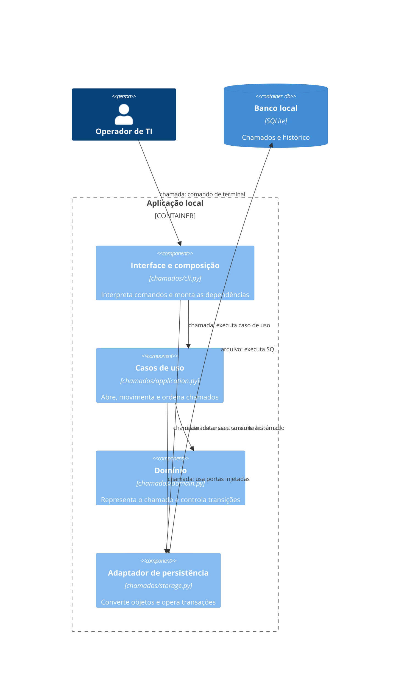

# C4 nível 3 · Componentes

```mermaid
C4Component
Person(operador, "Operador de TI")
Container_Boundary(cli, "Aplicação local") {
    Component(entrada, "Interface e composição", "chamados/cli.py", "Interpreta comandos e monta as dependências")
    Component(servico, "Casos de uso", "chamados/application.py", "Abre, movimenta e ordena chamados")
    Component(dominio, "Domínio", "chamados/domain.py", "Representa o chamado e controla transições")
    Component(persistencia, "Adaptador de persistência", "chamados/storage.py", "Converte objetos e opera transações")
}
ContainerDb(banco, "Banco local", "SQLite", "Chamados e histórico")
Rel(operador, entrada, "chamada: comando de terminal")
Rel(entrada, servico, "chamada: executa caso de uso")
Rel(entrada, persistencia, "chamada: instancia e consulta histórico")
Rel(servico, dominio, "chamada: cria e transiciona chamado")
Rel(servico, persistencia, "chamada: usa portas injetadas")
Rel(persistencia, banco, "arquivo: executa SQL")
```
