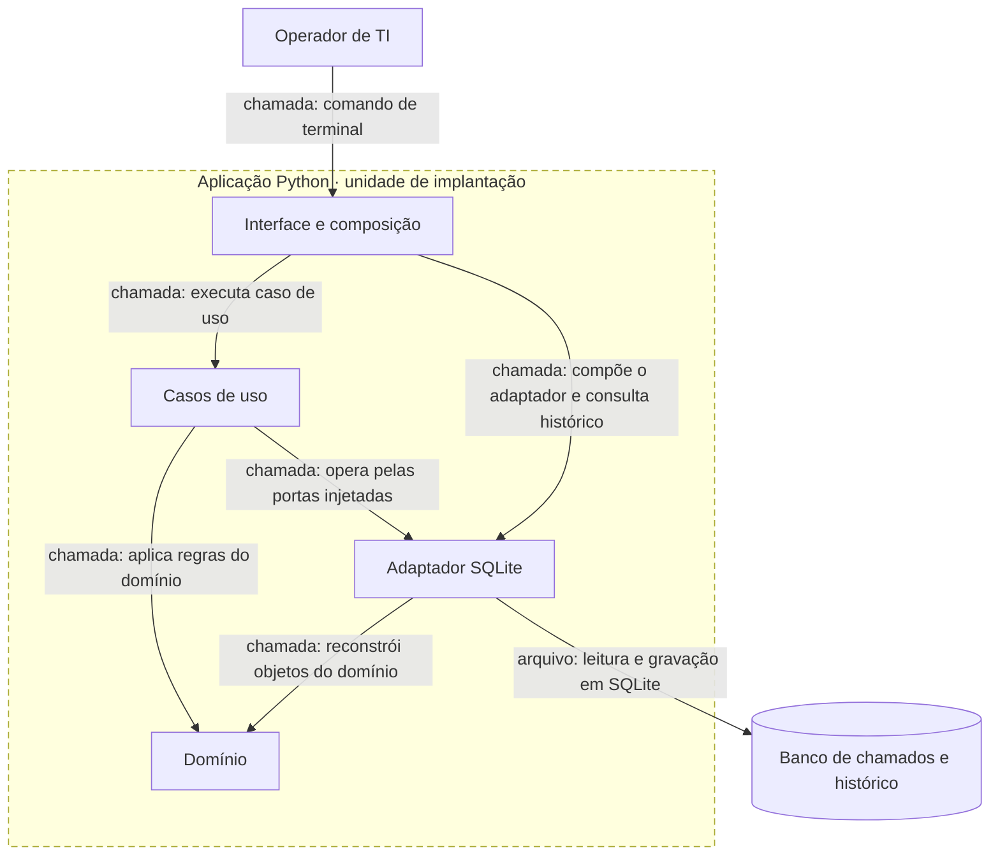

# C4 nível 3 · Componentes

```mermaid
flowchart TB
    operador["Operador de TI"]
    subgraph app["Aplicação Python · unidade de implantação"]
        cli["Interface e composição"]
        casos["Casos de uso"]
        dominio["Domínio"]
        persistencia["Adaptador SQLite"]
    end
    banco[("Banco de chamados e histórico")]
    operador -->|"chamada: comando de terminal"| cli
    cli -->|"chamada: executa caso de uso"| casos
    cli -->|"chamada: compõe o adaptador e consulta histórico"| persistencia
    casos -->|"chamada: aplica regras do domínio"| dominio
    casos -->|"chamada: opera pelas portas injetadas"| persistencia
    persistencia -->|"chamada: reconstrói objetos do domínio"| dominio
    persistencia -->|"arquivo: leitura e gravação em SQLite"| banco
    style app stroke-dasharray: 6 4
```
