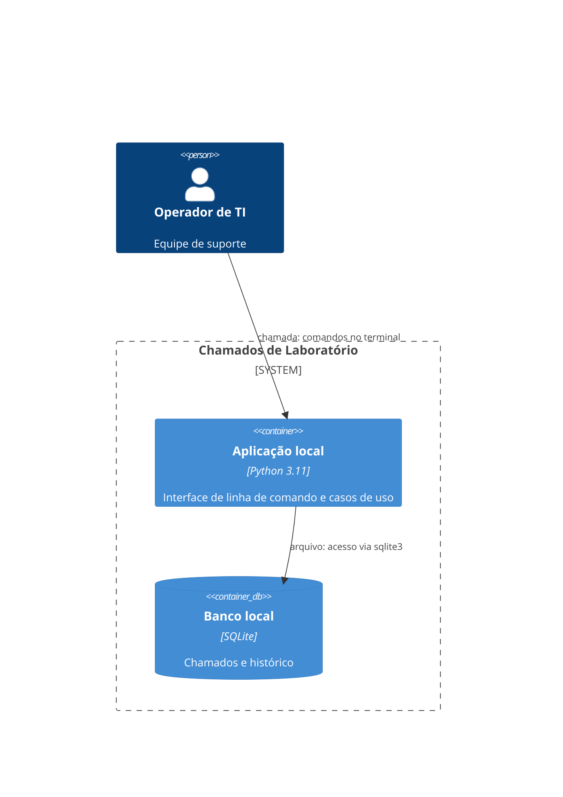

# C4 nível 2 · Contêineres

```mermaid
C4Container
Person(operador, "Operador de TI", "Equipe de suporte")
System_Boundary(sistema, "Chamados de Laboratório") {
    Container(cli, "Aplicação local", "Python 3.11", "Interface de linha de comando e casos de uso")
    ContainerDb(banco, "Banco local", "SQLite", "Chamados e histórico")
}
Rel(operador, cli, "chamada: comandos no terminal")
Rel(cli, banco, "arquivo: acesso via sqlite3")
```
