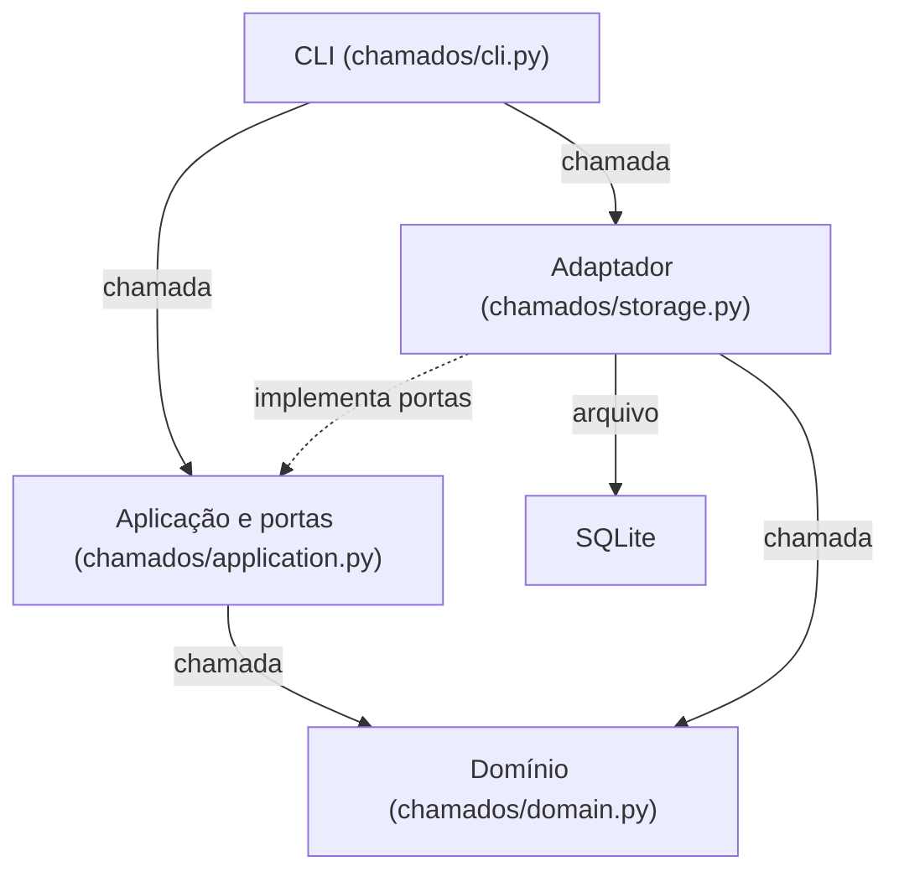

# Organização interna

```mermaid
flowchart TD
    cli["CLI (chamados/cli.py)"] -->|chamada| app["Aplicação e portas (chamados/application.py)"]
    cli -->|chamada| banco["Adaptador (chamados/storage.py)"]
    app -->|chamada| dominio["Domínio (chamados/domain.py)"]
    banco -. implementa portas .-> app
    banco -->|chamada| dominio
    banco -->|arquivo| sqlite["SQLite"]
```
