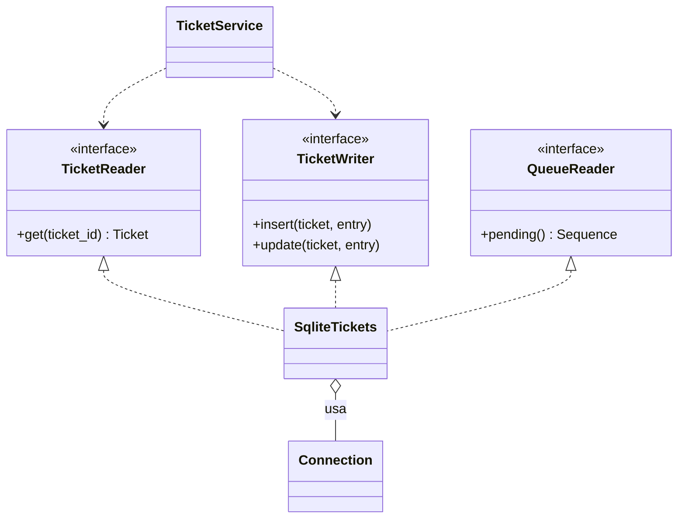

# Classes · Adapter

```mermaid
classDiagram
    TicketService ..> TicketReader
    TicketService ..> TicketWriter
    TicketReader <|.. SqliteTickets
    TicketWriter <|.. SqliteTickets
    QueueReader <|.. SqliteTickets
    SqliteTickets o-- Connection : usa
    class TicketReader {
        <<interface>>
        +get(ticket_id) Ticket
    }
    class TicketWriter {
        <<interface>>
        +insert(ticket, entry)
        +update(ticket, entry)
    }
    class QueueReader {
        <<interface>>
        +pending() Sequence
    }
```
