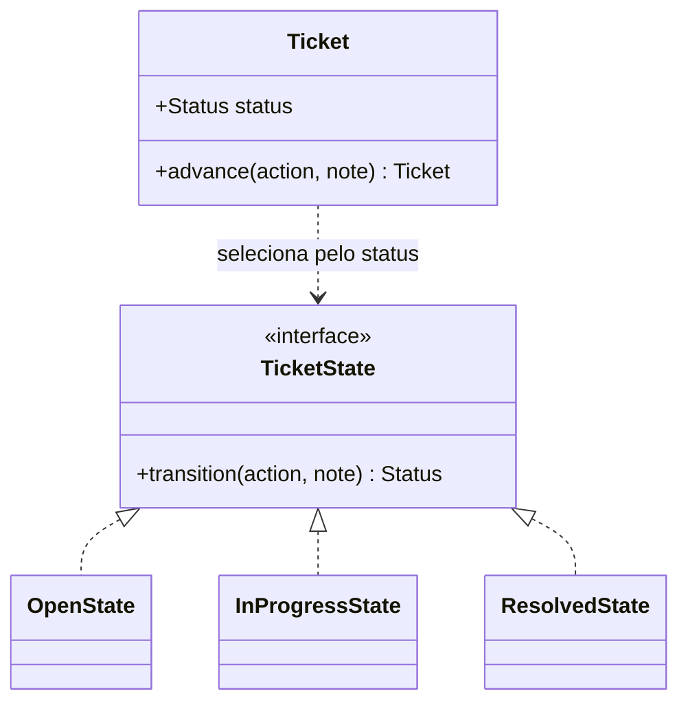

# Classes · State

```mermaid
classDiagram
    Ticket ..> TicketState : seleciona pelo status
    TicketState <|.. OpenState
    TicketState <|.. InProgressState
    TicketState <|.. ResolvedState
    class Ticket {
        +Status status
        +advance(action, note) Ticket
    }
    class TicketState {
        <<interface>>
        +transition(action, note) Status
    }
```
