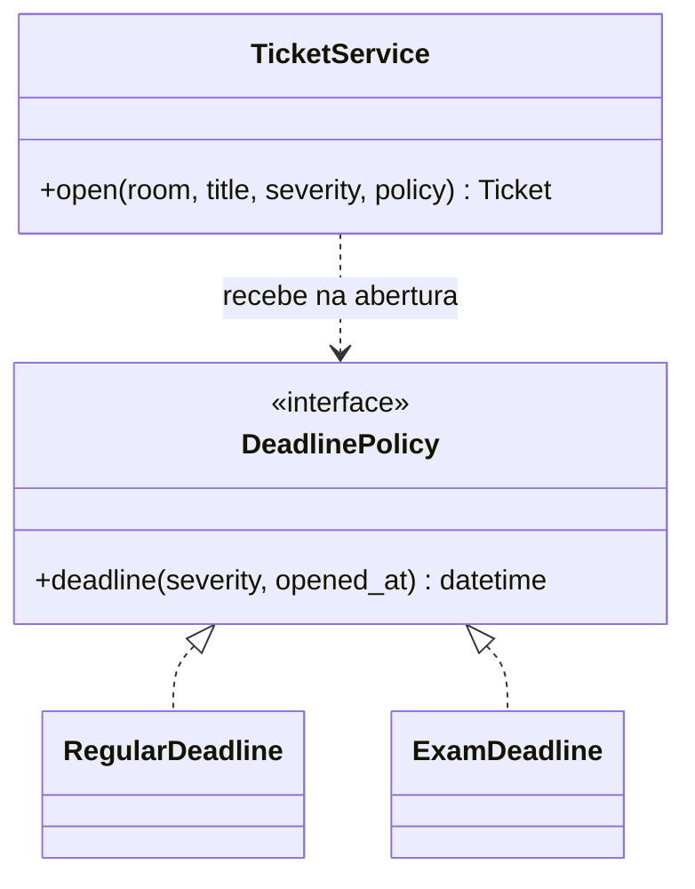

# Classes · Strategy

```mermaid
classDiagram
    TicketService ..> DeadlinePolicy : recebe na abertura
    DeadlinePolicy <|.. RegularDeadline
    DeadlinePolicy <|.. ExamDeadline
    class DeadlinePolicy {
        <<interface>>
        +deadline(severity, opened_at) datetime
    }
    class TicketService {
        +open(room, title, severity, policy) Ticket
    }
```
