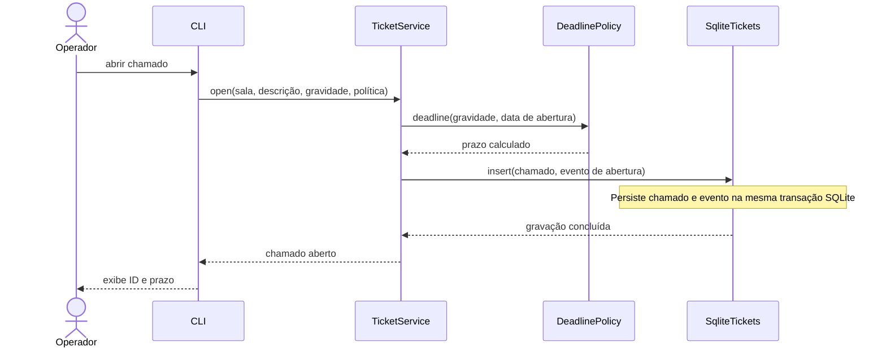

# Sequência · Abertura de chamado

```mermaid
sequenceDiagram
    actor Op as Operador
    participant CLI
    participant Servico as TicketService
    participant Politica as DeadlinePolicy
    participant Repo as SqliteTickets
    Op->>CLI: abrir chamado
    CLI->>Servico: open(sala, descrição, gravidade, política)
    Servico->>Politica: deadline(gravidade, data de abertura)
    Politica-->>Servico: prazo calculado
    Servico->>Repo: insert(chamado, evento de abertura)
    Note over Repo: Persiste chamado e evento na mesma transação SQLite
    Repo-->>Servico: gravação concluída
    Servico-->>CLI: chamado aberto
    CLI-->>Op: exibe ID e prazo
```
